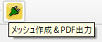
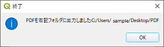

# メッシュ印刷プラグイン利用マニュアル

## レイアウトについて

QGISプロジェクトで、レイアウトマネージャーにレイアウトが登録されている必要があります。

かつ、レイアウトには、地図のオブジェクト「map」が登録されている必要があります。

レイアウトの登録およびオブジェクトの追加方法は、QGISのヘルプなどを参照ください。

## 起動

プラグインメニューから「メッシュ作成＆PDF出力」をクリックします。
 
下記のようなダイアログ画面が表示されます。

## ダイアログ画面詳細

|    |    |
| ---- | ---- |
| 用紙サイズ | 下記式のメッシュの大きさを決める用紙サイズ（QGISプロジェクトのレイアウトマネージャーに登録されているレイアウト名） |
| 縮尺 | 下記式のメッシュの大きさを決める地図の縮尺 |

＜メッシュタイルの大きさ＞ 
メッシュタイル幅(m)　  ＝　用紙サイズの幅(mm)/1000 * 縮尺 
メッシュタイル高さ(m)　＝　用紙サイズの高さ(mm)/1000 * 縮尺

## メッシュ作成

ダイアログ画面で、用紙サイズと縮尺を指定し、「メッシュ作成」ボタンをクリックします。 
すると、下記のようにメッシュタイルレイヤーが作成され、表示されます。 
タイルの色はランダムです。

地図は地理院地図（http://cyberjapandata.gsi.go.jp/）

## PDF出力（単一）

ダイアログ画面でメッシュ番号を記入し、「PDF作成」ボタンをクリックします。
　例）1 ⇒　メッシュ番号「1」のものが作成されます。

出力フォルダを指定後、メッセージが表示され、下記のようなPDFファイルが出力されます。

 

 ファイル名：用紙サイズ名 + "_" + メッシュ番号

表示

## PDF出力（複数連続）

複数指定することも可能で、メッシュごとにPDF出力されます。 
指定方法：半角カンマ区切り、半角ハイフン連携 
　　　　例） 1,3,5-10　⇒1,3番と、5～10番まで

出力フォルダ

数値以外を入力すると、下記のようなエラーメッセージが表示されます。

