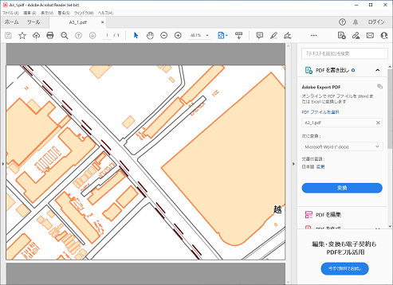

# メッシュ印刷プラグイン

画面範囲をメッシュで分割しPDF出力するQGISプラグインです。

## 概要

### ダイアログ画面

### メッシュ作成例

地図は地理院地図（http://cyberjapandata.gsi.go.jp/）

### 出力例

上記で、メッシュ番号１を指定

## 利用方法

利用方法については、[使い方](./MANUAL.md)をご確認ください。

## ライセンス

本ツールは GNU GENERAL PUBLIC LICENSE v2 ライセンスが設定されています。[GNU GENERAL PUBLIC LICENSE Version 2, June 1991](https://www.gnu.org/licenses/old-licenses/gpl-2.0.txt)